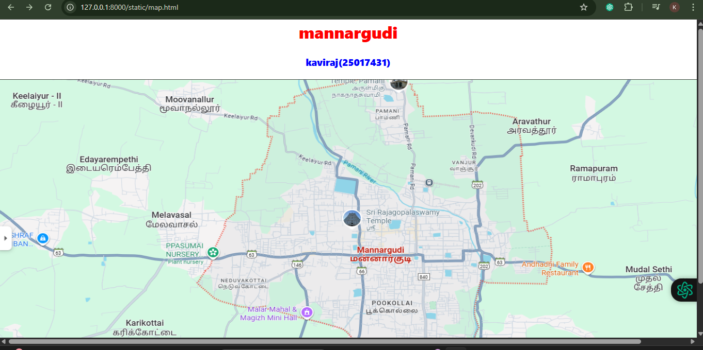
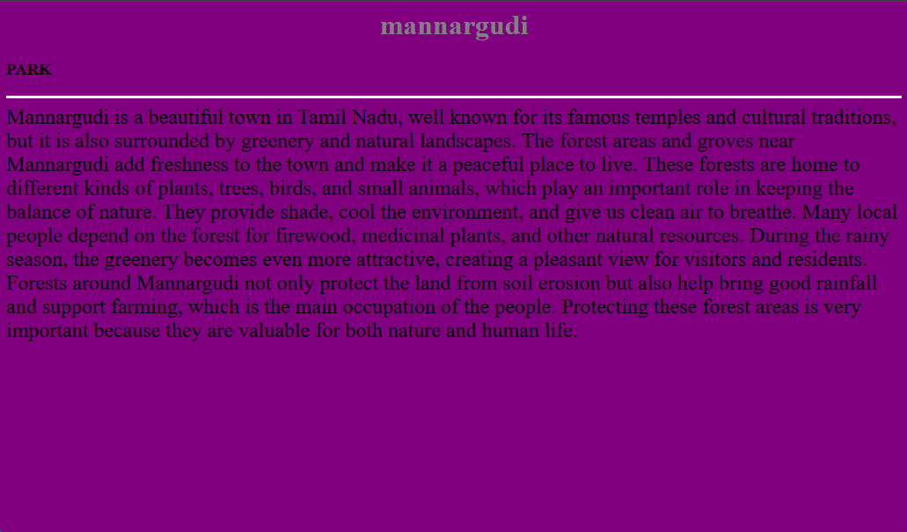

# Ex04 Places Around Me
# Date:24/09/2025
# AIM
To develop a website to display details about the places around my house.

# DESIGN STEPS
## STEP 1
Create a Django admin interface.

## STEP 2
Download your city map from Google.

## STEP 3
Using <map> tag name the map.

## STEP 4
Create clickable regions in the image using <area> tag.

## STEP 5
Write HTML programs for all the regions identified.

## STEP 6
Execute the programs and publish them.

# CODE
```
map.html

<<<<<<< HEAD

=======
>>>>>>> 1a6099d0f6a352e1208c53136f6d4732c47b07cf
<html>
<head>
<title>My City</title>
</head>
<body>
<h1 align="center">
<font color="red"><b>mannargudi</b></font>
</h1>
<h3 align="center">
<font color="blue"><b>kaviraj(25017431)</b></font>
</h3>
<center>

<map name="MyCity">
<area shape="rect" coords="700,250,850,400" href="temple.html" title="My Home Town">
<area shape="rect" coords="570,230,45" href="park.html" title="My Home Town">
<area shape="rect" coords="640,200,30" href="town.html" title="My Home Town">
</map>
</center>
</body>
</html>

temple.html

<<<<<<< HEAD

=======
>>>>>>> 1a6099d0f6a352e1208c53136f6d4732c47b07cf
<html>
<head>
<title>My Home Town</title>
</head>
<body bgcolor="yellow">
<h1 align="center">
<font color="red"><b>mannargudi</b></font>
</h1>
<h3 align="center">
<p align="justify">
<font color="blue"><b>big temple - The Tourists Attraction</b></font>
</p>
</h3>
<p align="justify">
<hr size="3" color="red">
<font face="mannai" size="5">
Mannargudi is a beautiful and historic town located in the Tiruvarur district of Tamil Nadu, India. It is famously known as the "Temple Town" because of its rich spiritual heritage. The town’s pride is the Rajagopalaswamy Temple, a massive and ancient Vaishnavite temple dedicated to Lord Krishna (Rajagopalaswamy). This temple attracts thousands of devotees every year, especially during festivals like Panguni Thiruvizha.
Mannargudi is surrounded by lush green paddy fields, coconut groves, and small water canals, making it a peaceful and scenic place. Agriculture is the main occupation here, and the town is well-known for its rice cultivation.
Culturally, Mannargudi has a deep connection with Carnatic music, Bharatanatyam dance, and Tamil traditions. The people are warm and friendly, and the town maintains a mix of tradition and simple modern lifestyle.
It is also well-connected by road and rail, making it easy to travel to nearby towns like Thiruvarur, Thanjavur, and Kumbakonam.
</font>
</p>
</body>
</html>


park.html

<<<<<<< HEAD

=======
>>>>>>> 1a6099d0f6a352e1208c53136f6d4732c47b07cf
<html>
<head>
<title>parks</title>
</head>
<body bgcolor="red">
<h1 align="center">
<font color="aqua"><b>mannargudi</b></font>
</h1>
<h3 align="center">
<p align="justify">
<font color="black"><b>PARK</b></font>
</p>
</h3>
<p align="justify">
<hr size="3" color="white">
<font face="mannai" size="5">
Mannargudi has a beautiful public park that is a favorite spot for families and children. The park has well-maintained walking paths, green lawns, and shady trees, making it a peaceful place for morning and evening walks. 
There are play areas for kids with swings, slides, and benches for visitors to relax.
Many people visit the park for jogging, yoga, and spending time with friends in the fresh air. 
During weekends and evenings, the park becomes lively with families and children enjoying the open space. 
It is one of the best places in the town for relaxation and recreation.
</font>
</p>
</body>
</html>


town.html

<<<<<<< HEAD

=======
>>>>>>> 1a6099d0f6a352e1208c53136f6d4732c47b07cf
<html>
<head>
<title>Town</title>
</head>
<body bgcolor="hotpink">
<h1 align="center">
<font color="black"><b>mannargudi</b></font>
</h1>
<h3 align="center">
<p align="justify">
<font color="black"><b>TOWNS AND STORES</b></font>
</p>
</h3>
<p align="justify">
<hr size="3" color="black">
<font face="mannai" size="5">
Mannargudi has a lively town area with busy streets full of shops and small businesses. 
You can find vegetable markets, grocery stores, textile shops, jewelry stores, and traditional sweet stalls. 
There are also modern stores and supermarkets where people shop for daily needs. 
The town area is always active, especially in the mornings and evenings, when people come to buy fresh vegetables and other goods.
Mannargudi’s main streets are well-known for their festival decorations, especially during temple festivals, when the entire town lights up with colors and crowds. 
It gives a perfect mix of traditional and modern lifestyle.
</font>
</p>
</body>
</html>
<<<<<<< HEAD


village.html


<html>
<head>
<title>parks</title>
</head>
<body bgcolor="green">
<h1 align="center">
<font color="maroon"><b>mannargudi</b></font>
</h1>
<h3 align="center">
<p align="justify">
<font color="white"><b>PARK</b></font>
</p>
</h3>
<p align="justify">
<hr size="3" color="white">
<font face="mannai" size="5">
Mannargudi is a well-known town in Tamil Nadu, famous for its temples, traditions, and natural surroundings. 
The town is surrounded by green fields, groves, and small forest areas that make the environment peaceful and refreshing. 
The forest regions near Mannargudi are home to different trees, birds, and animals, which help in keeping nature balanced. 
They provide clean air, protect the land, and support farming by bringing good rainfall.
The villages around Mannargudi are simple and beautiful, with people mostly engaged in agriculture. 
Vast paddy fields, coconut trees, and canals can be seen across the village areas, giving a pleasant and traditional look. 
The villagers live close to nature and depend on farming for their livelihood. Life in these villages is calm and friendly, where people help one another and celebrate festivals together. 
The combination of forests, fields, and village life makes Mannargudi a unique place filled with both natural beauty and cultural richness.
</font>
</p>
</body>
</html>


forest.html


<html>
<head>
<title>parks</title>
</head>
<body bgcolor="purple">
<h1 align="center">
<font color="gray"><b>mannargudi</b></font>
</h1>
<h3 align="center">
<p align="justify">
<font color="black"><b>PARK</b></font>
</p>
</h3>
<p align="justify">
<hr size="3" color="white">
<font face="mannai" size="5">
Mannargudi is a beautiful town in Tamil Nadu, well known for its famous temples and cultural traditions, but it is also surrounded by greenery and natural landscapes.
The forest areas and groves near Mannargudi add freshness to the town and make it a peaceful place to live. 
These forests are home to different kinds of plants, trees, birds, and small animals, which play an important role in keeping the balance of nature. 
They provide shade, cool the environment, and give us clean air to breathe. 
Many local people depend on the forest for firewood, medicinal plants, and other natural resources. 
During the rainy season, the greenery becomes even more attractive, creating a pleasant view for visitors and residents. 
Forests around Mannargudi not only protect the land from soil erosion but also help bring good rainfall and support farming, which is the main occupation of the people. 
Protecting these forest areas is very important because they are valuable for both nature and human life.
</font>
</p>
</body>
</html>


```

# OUTPUT




=======
```
# OUTPUT


>>>>>>> 1a6099d0f6a352e1208c53136f6d4732c47b07cf
# RESULT
The program for implementing image maps using HTML is executed successfully.
